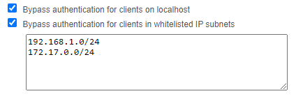

# QbittChecker

## QbittChecker

#### A Red-DiscordBot cog that retrieves torrents from qBittorrent client and sends an embed with their status.

### Installation

To install the QbittChecker cog, please follow these steps:

Install the cog with the following command: [p]repos install https://github.com/Cody-Cooper/CoopCogs/
Load the cog with the following command: [p]load qbittchecker

Commands
`[p]downloads`
Retrieves torrents from qBittorrent client and sends an embed with their status.

### Implementation

This cog retrieves torrents from qBittorrent client using its REST API. The login method logs in to the client and returns the cookies, while the get_torrents method retrieves the list of torrents. The downloads command filters the torrents by their status and creates an embed with the relevant information.

#### Docker setup

The cog uses environment variables to retrieve the qBittorrent URL, username, and password. The following environment variables must be set:

- **QBITTORRENT_URL**: The URL of the qBittorrent client.
- **QBITTORRENT_USERNAME**: The username for logging in to the qBittorrent client.
- **QBITTORRENT_PASSWORD**: The password for logging in to the qBittorrent client.

If these environment variables are not set, the cog will not work properly.

If using Unraid you can set them in the docker template like so:

#### qBittorrent setup

Ensure that in the qBittorrent WebUI, the following settings are set on the Web UI tab:

- Username
- Password
- Bypass authentication for clients on localhost
- Bypass authentication for clients in whitelisted IP subnets

Add both your server AND docker container IP to the bypasses on the Web UI tab.

